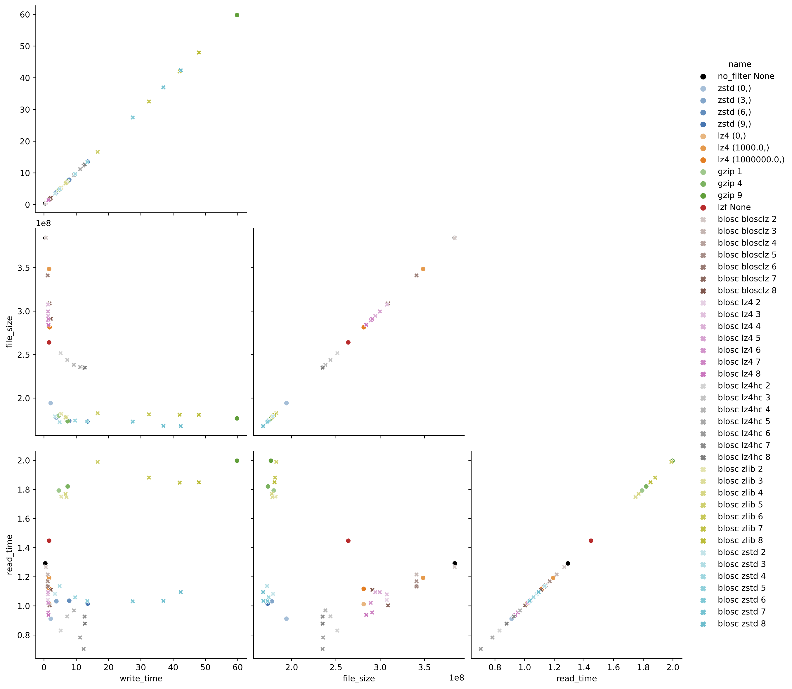

Assessing NWB compression options
=================================

When submitting large dandisets, it is important that users consider data compression options, which can substantially 
reduce the size of the files. Making files smaller reduces the burden of the DANDI Archive, and make the files more 
convenient to download. HDF5 has the ability to apply chunking and compression to datasets, which breaks large datasets
into smaller chunks and applies lossless compression to each chunk. This approach reduces the volume of the HDF5 
file without changing the values of the dataset, and in some cases can even improve read or write speeds above naive
uncompressed binary data. HDF5 ships with the compression algorithms GZIP and LZ4, and can support additional
dynamically loaded filters. DANDI has requested that large datasets be compressed, as it reduces the main These 
different algorithms and settings present myriad potential configurations, and a number of questions for NWB users 
unfamiliar with this type of data engineering:

By how much can the volume of my data be reduced?

What options are available and how can I access these options?

What compression algorithms and settings are best for me?

The answers to all of these questions depend on the specific use-cases, but the analysis below should help. 

There are generally 3 metrics you might care about: file size, read speed, and write speed. You also might care how
accessible your dataset is, i.e. whether the HDF5 library would be able to read your file out of the box or require
the installation of a dynamic filter. There are several parameters we can explore. Let's start with compression
algorithm (gzip, lz4, zstd, etc.) and level of algorithm. Increasing the level attempts to make the file smaller at the
cost of additional compute time.

## Approach

We ran a scan over several popular compression algorithms using the
[h5plugin](http://www.silx.org/doc/hdf5plugin/latest/) library, which automatically compiles 
and installs several algorithms and makes them available to [h5py](https://docs.h5py.org/en/stable/index.html). If using
Python, we highly recommend using this package, as it vastly simplifies the installation process for a good variety of
popular compression algorithms.For test data, we are using ap data from a Neuropixel probe recorded using the SpikeGLX
acquisition system from [dandiset 000053](https://dandiarchive.org/dandiset/000053/0.210819.0345), which is high-pass
voltage data prior to spike-sorting. We expect this to be a common use-case for NWB. Here, we are relying on h5py to
automatically determine chunk shape, and shuffle is off.

## Results


Figure 1. The black circle shows data that is chunked but not compressed. Each color represents a different 
algorithm and the lightness/darness of the color indicates compression level.

Of the filters we tested, zstd shows the best overall results. zstd is about tied with
gzip and blosz zlib for the best data compression ratio (about 45%). At low to moderate levels of compression, zstd 
is also close to optimal for read and write speed. For higher levels, zstd write speed increases dramatically without 
much additional space savings, so our recommendations for best all-around performance would be zstd level 4. zstd is 
faster than naive binary read, but if you are optimizing for read speed above all else, blosc lz4 is the only 
algorithm we tested that can be read substantially faster than zstd (1.25x). If using blosz lz4, level 4 appears to 
offer a good trade-off between size and speed. Note that the default gzip performs substantially worse in read time 
(about 1.8x zstd), but at moderate levels (e.g. the default 4) has about the same performance in file size and write 
time, making it an adequate alternative for users unable to configure custom dynamic filters or anticipating that the 
readers of their data may not be able to do so.

## Discussion

There are a variety of compression options supported by HDF5. zstd level 4 will probably be the best for most NWB 
users, there is no one option that is best in every category and every option comes with trade-offs.

### MATLAB users
MATLAB has officially supported reading HDF5 datasets with dynamically loaded filters since 2015a, however this 
requires some custom configuration and we have not yet found a convenient way to do this. We have heard that MATLAB 
2022a will be the first release to support _writing_ HDF5 Datasets with dynamically loaded filters. More tutorials 
to come once we figure that out.

## Code

```python
import os
import hdf5plugin
import h5py
import time
from tqdm import tqdm
import matplotlib.pyplot as plt
import json
import pandas as pd
import seaborn as sns


def test_filter(run_name, **kwargs):
    """Get write time, read time, and file size for a run."""
    
    fname = f"{run_name}.h5"
        

    with h5py.File(fname, mode="w") as file:
        start = time.time()
        file.create_dataset(**kwargs)
        write_time = time.time() - start

    file_size = os.stat(fname).st_size

    with h5py.File(fname, mode="r") as file:
        start = time.time()
        data = file['data'][:]
        read_time = time.time() - start

    return dict(
        name=run_name,
        write_time=write_time,
        file_size=file_size,
        read_time=read_time,
    )

def create_mini_palette(color, filter_, compression_opts_list):
    """Create palette of different shades of the same color for a given filter."""
    
    mini_pallete = sns.light_palette(
    color=color,
    n_colors=len(compression_opts_list)+2)[2:]
    for comp_opts, this_color in zip(compression_opts_list, mini_pallete):
        palette.update({f"{filter_} {comp_opts}": this_color})
    return palette

fpath = "data/sub-npJ1_ses-20190521_behavior+ecephys.nwb"

file = h5py.File(fpath, 'r')

data = file['acquisition/ElectricalSeries/data'][:1000000]
print(f"{data.nbytes / 1e9} GB")

# set up parameters for tests
filters = {
    'no_filter': dict(
        filter_class={'chunks':True},
        compression_opts_list=[None],
    ),
    'zstd': dict(
        filter_class=hdf5plugin.Zstd(),
        compression_opts_list=[
            (0,),
            (3,),
            (6,),
            (9,),
            
        ],
    ),
    'lz4': dict(
        filter_class=hdf5plugin.LZ4(),
        compression_opts_list=[
            (0,),
            (1e3,),
            (1e6,),
        ],
    ),
    'gzip': dict(
        filter_class=dict(compression='gzip'),
        compression_opts_list=[
            1, 4, 9
        ]
    ),
    'lzf': dict(
        filter_class=dict(compression='lzf'),
        compression_opts_list=[None,],
    )
}


blosc_filters = ["blosclz", "lz4", "lz4hc", "zlib", "zstd"]

results = []


## run filters

#test non-blosc filters
for filter_name, filter_dict in tqdm(list(filters.items()), desc='non-blosc'):
    args = dict(
        name="data",
        data=data,
        **filter_dict["filter_class"]
    )
    for compression_opts in filter_dict["compression_opts_list"]:
        args.update(compression_opts=compression_opts)
        run_name = f"{filter_name} {compression_opts}"
        results.append(test_filter(run_name, **args))

# test blosc filters
for filter_name in tqdm(blosc_filters, desc='blosc'):
    for level in range(2, 9):
        args=dict(
            name="data",
            data=data,
            **hdf5plugin.Blosc(cname=filter_name, clevel=level, shuffle=0)
        )
        run_name = f"blosc {filter_name} {level}"
        results.append(test_filter(run_name, **args))

# dump results
with open('results.json', 'w') as file:
    json.dump(results, file)
    

df = pd.DataFrame(results)

# visualization - construct palette

# for non-blosc
counter = 0
base_palette = sns.color_palette(n_colors=11)
palette = {'no_filter None': 'k'}
for filter_, filter_dict in list(filters.items())[1:]:
    color = base_palette[counter]
    if filter_ not in ('no_filter None',):
        palette.update(create_mini_palette(color, filter_, filter_dict["compression_opts_list"]))
    counter += 1


# for blosc
for filter_name in blosc_filters:
    counter += 1
    color = base_palette[counter]
    palette.update(create_mini_palette(color, "blosc " + filter_name, range(2,9)))

n_filters = sum(len(x["compression_opts_list"]) for x in filters.values())
n_blosc_filters = 7*len(blosc_filters)
markers = ['o'] * n_filters + ['X'] * n_blosc_filters

sns.pairplot(data=df, hue="name", palette=palette, markers=markers, size=4, corner=True, diag_kind=None)

plt.savefig("eval_compressions.pdf", bbox_inches="tight")
```